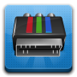
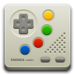

# Faience Extra Icons

Custom icons for Faience Icon Theme made by [Matthieu James](http://tiheum.deviantart.com/).

Faba Icon Theme (the icon assets and sources) are licensed under a [General Public License 3.0](https://www.gnu.org/licenses/gpl-3.0.en.html) license.

Any bundled software is free software; you can redistribute it and/or modify it under the terms of the GNU General Public License as published by the Free Software Foundation; either version 3, or (at your option) any later version.

*The icons are no longer maintained (the last update was made in 2012), as the Faience/Faenza are no longer being developed, sorry.*

## Downloading the original Icon Theme

The original source for Faience Icon Theme can be found [here](http://tiheum.deviantart.com/art/Faience-icon-theme-255099649). Since Faience heavily depends on [Faenza](http://tiheum.deviantart.com/art/Faenza-Icons-173323228), be sure to install both.
